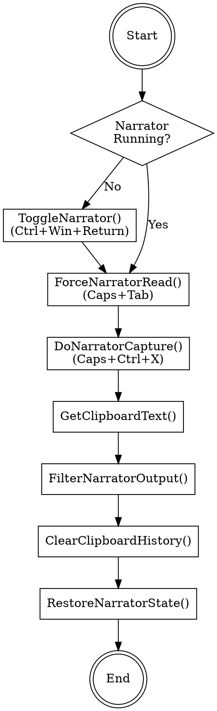

# getNarratorOutput C# Implementation Plan

> **For agentic workers:** REQUIRED: Use superpowers:subagent-driven-development (if subagents available) or superpowers:executing-plans to implement this plan.

**Goal:** Convert `getNarratorOutput()` from Python to C# as native methods in PCTB.cs (inside `#region Narrator`), including all required helper functions. Also update Python backup file to match C# logic.

**Architecture:** All code integrated directly into PCTB.cs inside `#region Narrator` as static helper methods with Win32 P/Invoke declarations. Python backup file will be updated to match same logic.

**Tech Stack:** C# .NET Framework 4.8, System.Windows.Forms.SendKeys, Win32 Clipboard API

---

## Context

### Problem Statement
- Currently `getNarratorOutput()` in PCTB.cs calls Python CLI via HTTP API
- Need to convert to native C# to eliminate Python dependency
- Must include `ForceNarratorRead()` to ensure correct first element capture

### Workflow Diagram

### Required Functions (Python → C# Naming)

All functions will be implemented inside `#region Narrator` in PCTB.cs

| Python (snake_case) | C# (PascalCase) | Source File | Purpose |
|---------------------|-----------------|-------------|---------|
| `IsNarratorRunning()` | `IsNarratorRunning()` | pc_output_narrator.py | Check if narrator.exe running |
| `toggle_narrator()` | `ToggleNarrator()` | pc_keys.py | Toggle Narrator on/off (Ctrl+Win+Return) |
| `force_narrator_read()` | `ForceNarratorRead()` | pc_keys.py | Force read current element (Caps+Tab) |
| `_do_narrator_capture()` | `DoNarratorCapture()` | pc_output_narrator.py | Main capture logic (Caps+Ctrl+X) |
| `capture_narrator_last_spoken()` | `CaptureNarratorLastSpoken()` | pc_output_narrator.py | Full capture workflow |
| `_strip_narrator_confirmation()` | `FilterNarratorOutput()` | pc_output_narrator.py | Remove "copied to clipboard" messages |
| `clear_clipboard_history()` | `ClearClipboardHistory()` | pc_output_narrator.py | Clear Win+V clipboard history |
| `send_key_event()` | `SendKeyEvent()` | pc_keys.py | Send single key |
| `send_key_chord()` | `SendKeyChord()` | pc_keys.py | Send multiple keys |

---

## Implementation Tasks

### Task 1: Add Win32 Clipboard P/Invoke Layer to PCTB.cs

**Files:**
- Modify: `TalkBackAutoTest/PCTB.cs` - Add at top of class

**Steps:**
- [ ] Add constants: VK_*, SPI_*, CF_*
- [ ] Add Win32 Clipboard API declarations (initial):
  - `GetClipboardData()` - Lấy data từ clipboard
  - `GetClipboardSequenceNumber()` - Theo dõi thay đổi clipboard
  - `EmptyClipboard()` - Xóa clipboard
- [ ] Verify compilation
- [ ] *(Các hàm khác sẽ implement sau nếu cần)*

**Note:** Using SendKeys.SendWait() for keyboard (no P/Invoke needed). Only clipboard needs P/Invoke.

### Task 2: Add Keyboard Input Methods (using SendKeys.SendWait)

**Files:**
- Modify: `TalkBackAutoTest/PCTB.cs`

**Steps:**
- [ ] Add `SendKeyEvent(int vkCode)` - Send single key using SendKeys
- [ ] Add `SendKeyChord(string keyCombo)` - Send key combination using SendKeys format
- [ ] Add `ToggleNarrator()` - Ctrl+Win+Return
- [ ] Add `ForceNarratorRead()` - **Caps+Tab** for first element (cần đợi 1s trước khi gửi phím để tránh bị lặp)
- [ ] Verify compilation

**Note:** Using `SendKeys.SendWait()` instead of Win32 SendInput - already available via System.Windows.Forms

### Task 3: Add Clipboard Operations (Win32 P/Invoke)

**Files:**
- Modify: `TalkBackAutoTest/PCTB.cs`

**Steps:**
- [ ] Add `GetClipboardText()` - open, read, close clipboard (Win32)
- [ ] Add `GetClipboardSequenceNumber()` - track clipboard changes (Win32)
- [ ] Add `ClearClipboardHistory()` - clear clipboard history (Win+V)
- [ ] Verify compilation

### Task 4: Add Narrator Process Management

**Files:**
- Modify: `TalkBackAutoTest/PCTB.cs`

**Steps:**
- [ ] Add `IsNarratorRunning()` - iterate Process.GetProcesses() or use SPI_GETSCREENREADER
- [ ] Add `WaitForNarratorState(bool expectedRunning)` - retry with backoff
- [ ] Add `StartNarratorProcess()` - launch Narrator.exe
- [ ] Add `EnsureNarratorOn()` - auto-enable if off, returns bool? (null if failed)
- [ ] Add `RestoreNarratorState(bool? autoEnabled)` - restore previous state
- [ ] Verify compilation

### Task 5: Add Capture Implementation

**Files:**
- Modify: `TalkBackAutoTest/PCTB.cs`

**Steps:**
- [ ] Add `WaitForClipboardSequenceChange(uint seqBefore)` - wait for clipboard update
- [ ] Add `FilterNarratorOutput(string text)` - remove "copied to clipboard" messages
- [ ] Add `DoNarratorCapture()` - main capture logic with Caps+Ctrl+X
- [ ] Add `TryNarratorCapture()` - with retry logic
- [ ] Add `CaptureNarratorLastSpoken()` - full workflow: ForceNarratorRead() → DoNarratorCapture() → GetClipboardText() → FilterNarratorOutput() → ClearClipboardHistory()
- [ ] Verify compilation

### Task 6: Add Main Public API

**Files:**
- Modify: `TalkBackAutoTest/PCTB.cs`

**Steps:**
- [ ] Add `GetNarratorOutput()` - main public API: EnsureNarratorOn() → CaptureNarratorLastSpoken() → RestoreNarratorState()
- [ ] Add `TryCaptureNarratorIfRunning()` - no auto-toggle version
- [ ] Find and replace existing Python-call implementation
- [ ] Verify compilation

### Task 7: Update Python Backup File (Integrate pc_keys.py into pc_output_narrator.py)

**Files:**
- Modify: `TalkBackAutoTest/module/pc_output_narrator.py` - Merge all functions from pc_keys.py into this file

**Steps:**
- [ ] Copy all constants (VK_*, KEY_*) from pc_keys.py to pc_output_narrator.py
- [ ] Copy KEYBDINPUT, INPUT structures from pc_keys.py to pc_output_narrator.py
- [ ] Copy Win32 API declarations (SendInput, GetAsyncKeyState) from pc_keys.py to pc_output_narrator.py
- [ ] Copy all keyboard functions (send_key_event, send_key_chord, toggle_narrator, force_narrator_read) from pc_keys.py to pc_output_narrator.py
- [ ] Update `capture_narrator_last_spoken()` to follow new flow: ForceNarratorRead() → DoNarratorCapture() → GetClipboardText() → FilterNarratorOutput() → ClearClipboardHistory()
- [ ] Add 1 second delay in `force_narrator_read()` before sending keys (already done in Python)
- [ ] Update imports in pc_output_narrator.py to use local functions instead of pc_keys
- [ ] Verify Python code still works
- [ ] Commit

### Task 8: Testing

**Files:**
- Test: Manual testing in application

**Steps:**
- [ ] Run application
- [ ] Ensure Narrator is OFF
- [ ] Call `PCManager.GetNarratorOutput()` (via test button or breakpoint)
- [ ] Verify: Narrator auto-turns ON → element captured → clipboard cleared → Narrator restored to OFF

---

## Verification

### Compilation
- Build solution in Visual Studio
- No errors in Output window

### Runtime Test
1. Start app with Narrator OFF
2. Trigger GetNarratorOutput()
3. Check logs for:
   - "INFO: Narrator is off; auto-enabling for capture"
   - "Narrator restored to previous state"
4. Verify Narrator state is restored

### Edge Cases
- Narrator already running → should use existing session
- Clipboard locked → retry logic should handle
- Capture fails → should return null gracefully
