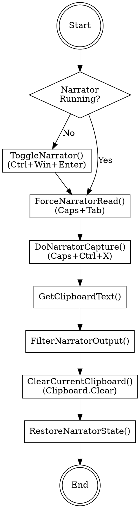
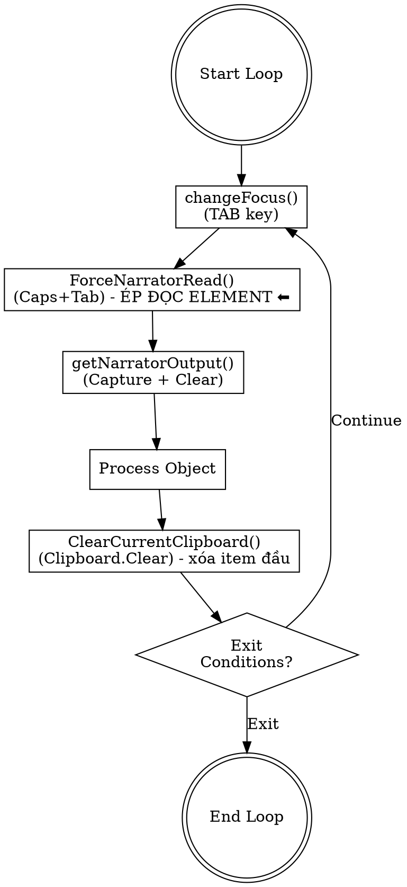

# getNarratorOutput C# Implementation Plan

> **For agentic workers:** REQUIRED: Use superpowers:subagent-driven-development (if subagents available) or superpowers:executing-plans to implement this plan.

**Goal:** Convert `getNarratorOutput()` from Python to C# as native methods in PCTB.cs (inside `#region Narrator`), including all required helper functions. Also update Python backup file to match C# logic.

**Architecture:** All code integrated directly into PCTB.cs inside `#region Narrator` as static helper methods with Win32 P/Invoke declarations. Python backup file will be updated to match same logic.

**Tech Stack:** C# .NET Framework 4.8, System.Windows.Forms.SendKeys, Win32 Clipboard API

---

## Context

### Problem Statement
- Currently `getNarratorOutput()` in PCTB.cs calls Python CLI via HTTP API
- Need to convert to native C# to eliminate Python dependency
- Must include `ForceNarratorRead()` to ensure correct first element capture

### Workflow Diagram



### Workflow Diagram - Test Loop (MainForm.getObjectInScreenPC)



**Điểm quan trọng đã cập nhật:**

1. **ForceNarratorRead() (Caps+Tab)** chỉ gọi cho **LẦN ĐẦU TIÊN** (phần tử đầu tiên trong vòng lặp) - đây là phím tắt để ép Narrator đọc element đầu tiên.

2. **Clipboard.Clear() thay vì ClearClipboardHistory():**
   - Mỗi lần capture, clipboard chỉ chứa 1 item (của element vừa được Narrator đọc)
   - `Clipboard.Clear()` xóa **phần tử đầu tiên** (clipboard hiện tại) - trong flow này chỉ có 1 item nên = xóa toàn bộ clipboard hiện tại
   - **KHÔNG cần** `clear_clipboard_history()` vì đã có `Clipboard.Clear()` thay thế

3. **Luồng đúng:**
   - Lần đầu: TAB → ForceNarratorRead() → Capture → checkIssue() → ClearCurrentClipboard()
   - Các lần tiếp theo: TAB → Capture → checkIssue() → ClearCurrentClipboard()

### Required Functions (Python → C# Naming)

All functions will be implemented inside `#region Narrator` in PCTB.cs

| Python (snake_case) | C# (PascalCase) | Source File | Purpose |
|---------------------|-----------------|-------------|---------|
| `IsNarratorRunning()` | `IsNarratorRunning()` | pc_output_narrator.py | Check if narrator.exe running |
| `toggle_narrator()` | `ToggleNarrator()` | pc_keys.py | Toggle Narrator on/off (Ctrl+Win+Enter) |
| `force_narrator_read()` | **`ForceNarratorRead()`** | pc_keys.py | **Force read current element (Caps+Tab) - QUAN TRỌNG cho element đầu tiên** |
| `_do_narrator_capture()` | `DoNarratorCapture()` | pc_output_narrator.py | Main capture logic (Caps+Ctrl+X) |
| `capture_narrator_last_spoken()` | `CaptureNarratorLastSpoken()` | pc_output_narrator.py | Full capture workflow |
| `_strip_narrator_confirmation()` | `FilterNarratorOutput()` | pc_output_narrator.py | Remove "copied last phrase to clipboard", "failed to copy to clipboard" messages |
| **`N/A`** | **`ClearCurrentClipboard()`** | System.Windows.Forms.Clipboard | **Clear current clipboard - xóa item đầu = xóa toàn bộ** |
| ~~`clear_clipboard_history()`~~ | ~~`ClearClipboardHistoryViaPython()`~~ | pc_output_narrator.py | ~~**KHÔNG CẦN** - đã có Clipboard.Clear()~~ |
| `send_key_event()` | `SendKeyEvent()` | pc_keys.py | Send single key |
| `send_key_chord()` | `SendKeyChord()` | pc_keys.py | Send multiple keys |

> **Lưu ý quan trọng về Clipboard.Clear():**
> - **ForceNarratorRead()** chỉ cần gọi cho **element ĐẦU TIÊN** (phần tử đầu tiên sau khi TAB sang)
> - **ClearCurrentClipboard()** được gọi **SAU** `checkIssue()` - sau khi so sánh element info vs Narrator log xong (PASS/FAIL)
> - **KHÔNG cần** `GetClipboardSequenceNumber()` vì ForceNarratorRead() đã đảm bảo text là mới
> - **KHÔNG cần** gọi WinRT `clear_clipboard_history()`

---

## Implementation Tasks

### Task 1: Add Win32 Clipboard P/Invoke Layer to PCTB.cs

**Files:**
- Modify: `TalkBackAutoTest/PCTB.cs` - Add at top of class

**Context:**
- **Win32 API đã có sẵn** trong .NET Framework 4.8 - **không cần cài NuGet**
- Chỉ cần khai báo `using System.Runtime.InteropServices;` và `using System.Windows.Forms;`
- `System.Windows.Forms.Clipboard.Clear()` đã có sẵn - dùng được ngay

**Steps:**
- [ ] Add `using System.Runtime.InteropServices;` (nếu chưa có)
- [ ] ~~Add Win32 P/Invoke declarations~~ - **KHÔNG CẦN** vì dùng System.Windows.Forms.Clipboard có sẵn
- [ ] Verify compilation
- [ ] *(Các hàm khác sẽ implement sau nếu cần)*

**Note:** Using SendKeys.SendWait() for keyboard (no P/Invoke needed). Clipboard operations dùng System.Windows.Forms.Clipboard có sẵn.

### Task 2: Add Keyboard Input Methods (using SendKeys.SendWait)

**Files:**
- Modify: `TalkBackAutoTest/PCTB.cs`

**Steps:**
- [ ] Add `SendKeyEvent(int vkCode)` - Send single key using SendKeys
- [ ] Add `SendKeyChord(string keyCombo)` - Send key combination using SendKeys format
- [ ] Add `ToggleNarrator()` - Ctrl+Win+Enter
- [ ] Add `ForceNarratorRead()` - **Caps+Tab** for first element (cần đợi 1s trước khi gửi phím để tránh bị lặp)
- [ ] Verify compilation

**Note:** Using `SendKeys.SendWait()` instead of Win32 SendInput - already available via System.Windows.Forms

### Task 3: Add Clipboard Operations

**Files:**
- Modify: `TalkBackAutoTest/PCTB.cs`

**Steps:**
- [ ] Add `GetClipboardText()` - open, read, close clipboard (sử dụng System.Windows.Forms.Clipboard)
- [ ] Add `ClearCurrentClipboard()` - xóa nội dung hiện tại (System.Windows.Forms.Clipboard.Clear())
- [ ] ~~Add `GetClipboardSequenceNumber()`~~ - **KHÔNG CẦN** vì ForceNarratorRead() đã đảm bảo text mới
- [ ] ~~Add `ClearClipboardHistoryViaPython()`~~ - **KHÔNG CẦN**
- [ ] Verify compilation

**Note:**
- **KHÔNG cần** `GetClipboardSequenceNumber()` vì `ForceNarratorRead()` đã đảm bảo text lấy được là mới
- **KHÔNG cần** gọi WinRT `clear_clipboard_history()`

### Task 4: Add Narrator Process Management

**Files:**
- Modify: `TalkBackAutoTest/PCTB.cs`

**Steps:**
- [ ] Add `IsNarratorRunning()` - iterate Process.GetProcesses() or use SPI_GETSCREENREADER
- [ ] Add `WaitForNarratorState(bool expectedRunning)` - retry with backoff
- [ ] Add `StartNarratorProcess()` - launch Narrator.exe
- [ ] Add `EnsureNarratorOn()` - auto-enable if off, returns bool? (null if failed)
- [ ] Add `RestoreNarratorState(bool? autoEnabled)` - restore previous state
- [ ] Verify compilation

### Task 5: Add Capture Implementation

**Files:**
- Modify: `TalkBackAutoTest/PCTB.cs`

**Steps:**
- [ ] Add `FilterNarratorOutput(string text)` - remove "copied last phrase to clipboard", "failed to copy to clipboard" messages
- [ ] Add `DoNarratorCapture()` - main capture logic with Caps+Ctrl+X
- [ ] Add `TryNarratorCapture()` - with retry logic
- [ ] Add `CaptureNarratorLastSpoken()` - workflow: DoNarratorCapture() → GetClipboardText() → FilterNarratorOutput()

**Note:**
- **ForceNarratorRead()** được gọi ở MainForm (Task 8), không cần trong hàm này
- **ClearCurrentClipboard()** được gọi ở MainForm sau checkIssue(), không cần trong hàm này
- **ForceNarratorRead()** chỉ cần cho **LẦN ĐẦU TIÊN** (phần tử đầu tiên)
- [ ] Verify compilation

### Task 6: Add Main Public API

**Files:**
- Modify: `TalkBackAutoTest/PCTB.cs`

**Steps:**
- [ ] Add `GetNarratorOutput()` - main public API: EnsureNarratorOn() → CaptureNarratorLastSpoken() → RestoreNarratorState()
- [ ] Add `TryCaptureNarratorIfRunning()` - no auto-toggle version
- [ ] Find and replace existing Python-call implementation
- [ ] Verify compilation

### Task 7: Update Python Backup File (Integrate pc_keys.py into pc_output_narrator.py)

**Files:**
- Modify: `TalkBackAutoTest/module/pc_output_narrator.py` - Merge all functions from pc_keys.py into this file

**Steps:**
- [ ] Copy all constants (VK_*, KEY_*) from pc_keys.py to pc_output_narrator.py
- [ ] Copy KEYBDINPUT, INPUT structures from pc_keys.py to pc_output_narrator.py
- [ ] Copy Win32 API declarations (SendInput, GetAsyncKeyState) from pc_keys.py to pc_output_narrator.py
- [ ] Copy all keyboard functions (send_key_event, send_key_chord, toggle_narrator, force_narrator_read) from pc_keys.py to pc_output_narrator.py
- [ ] Update flow trong `dumpScreen()`:
  - **Lần đầu tiên:** `force_narrator_read()` → `capture_narrator_last_spoken()` → **`Clipboard.Clear()`**
  - **Các lần tiếp theo:** `capture_narrator_last_spoken()` → **`Clipboard.Clear()`**
  - **Logic mới:** `Clipboard.Clear()` xóa phần tử đầu tiên - trong flow này chỉ có 1 item nên = xóa toàn bộ clipboard hiện tại
- [ ] Add 1 second delay in `force_narrator_read()` before sending keys (already done in Python)
- [ ] Update imports in pc_output_narrator.py to use local functions instead of pc_keys
- [ ] ~~Remove `clear_clipboard_history()` function~~ - **KHÔNG cần** vì đã có `Clipboard.Clear()`
- [ ] Verify Python code still works
- [ ] Commit

### Task 8: Update MainForm Loop Flow (CRITICAL - Thêm ForceNarratorRead)

**Files:**
- Modify: `TalkBackAutoTest/MainForm.cs`

**Context luồng hiện tại:**
```csharp
PCManager.changeFocus();
PCManager.getNarratorOutput();
Thread.Sleep(5000);
string objElement = PCManager.dumpFocusedObject();
PCManager.dumpScreen();
PCManager.checkIssue("1", "2");
```

**Luồng MỚI cần implement:**
```csharp
// Lần đầu tiên - ÉP ĐỌC element đầu
PCManager.changeFocus();
PCManager.ForceNarratorRead();  // ← THÊM - Chỉ cho element ĐẦU TIÊN
PCManager.getNarratorOutput();
Thread.Sleep(5000);
string objElement = PCManager.dumpFocusedObject();
PCManager.dumpScreen();
PCManager.checkIssue("1", "2");
PCManager.ClearCurrentClipboard();  // ← THÊM - Sau khi so sánh xong
```

**Steps:**
- [ ] Trong `getObjectInScreenPC()`, thêm `PCManager.ForceNarratorRead()` **SAU** `PCManager.changeFocus()` (chỉ cho element ĐẦU TIÊN trong vòng lặp)
- [ ] Thêm `PCManager.ClearCurrentClipboard()` **SAU** `PCManager.checkIssue("1", "2")` - sau khi so sánh element info vs Narrator log xong (PASS/FAIL)
- [ ] ~~Remove `ClearClipboardHistoryViaPython()` when exiting loop~~ - không cần thiết
- [ ] Verify compilation

> **ĐIỂM QUAN TRỌNG:**
> - **ForceNarratorRead()** chỉ cần cho element ĐẦU TIÊN - để đảm bảo Narrator đọc đúng element
> - **ClearCurrentClipboard()** đặt SAU checkIssue() để đảm bảo so sánh xong mới xóa

### Task 9: Testing

**Files:**
- Test: Manual testing in application

**Steps:**
- [ ] Run application
- [ ] Ensure Narrator is OFF
- [ ] Call `PCManager.GetNarratorOutput()` (via test button or breakpoint)
- [ ] Verify: Narrator auto-turns ON → element captured → clipboard cleared → Narrator restored to OFF
- [ ] Verify clipboard history is cleared after test loop exits

---

## Verification

### Compilation
- Build solution in Visual Studio
- No errors in Output window

### Runtime Test
1. Start app with Narrator OFF
2. Trigger GetNarratorOutput()
3. Check logs for:
   - "INFO: Narrator is off; auto-enabling for capture"
   - "Narrator restored to previous state"
4. Verify Narrator state is restored

### Edge Cases
- Narrator already running → should use existing session
- Clipboard locked → retry logic should handle
- Capture fails → should return null gracefully
